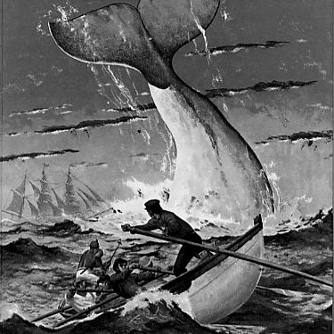

"What now?" said the Guernsey-man to Stubb.

<h1>"What now?" said the Guernsey-man to Stubb. "Why, since he takes it so easy, tell</h1>

<ul><li>"What now?" said the Guernsey-man to Stubb</li>

<li> "Why, since he takes it so easy, tell him that now I have eyed him carefully, I'm quite certain that he's no more fit to command a whale-ship than a St</li>

<li> Jago monkey</li>

<li> In fact, tell him from me he's a baboon</li>

<li>" "He vows and declares, Monsieur, that the other whale, the dried one, is far more deadly than the blasted one; in fine, Monsieur, he conjures us, as we value our lives, to cut loose from these fish</li></ul>

"What now?" said the Guernsey-man to Stubb. "Why, since he takes it so easy, tell him that now I have eyed him carefully, I'm quite certain that he's no more fit to command a whale-ship than a St. Jago monkey. In fact, tell him from me he's a baboon." "He vows and declares, Monsieur, that the other whale, the dried one, is far more deadly than the blasted one; in fine, Monsieur, he conjures us, as we value our lives, to cut loose from these fish." Instantly the captain ran forward, and in a loud voice commanded his crew to
